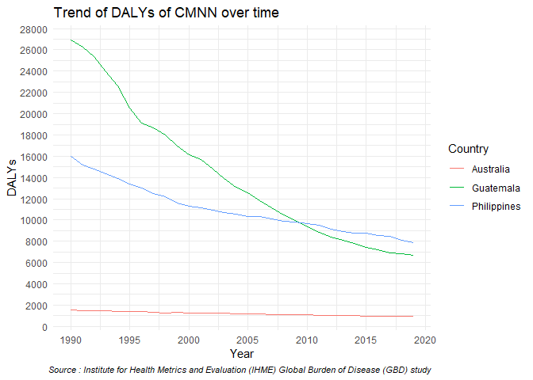
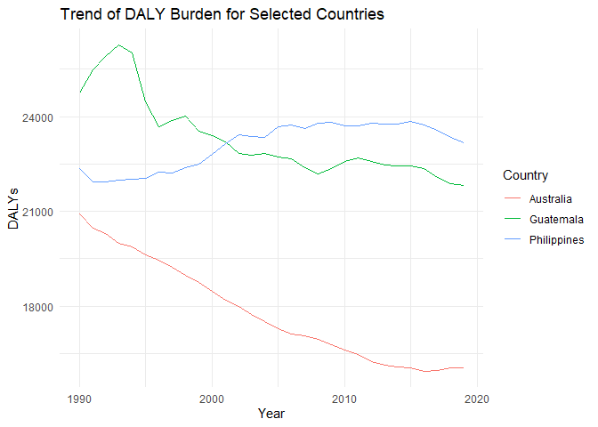
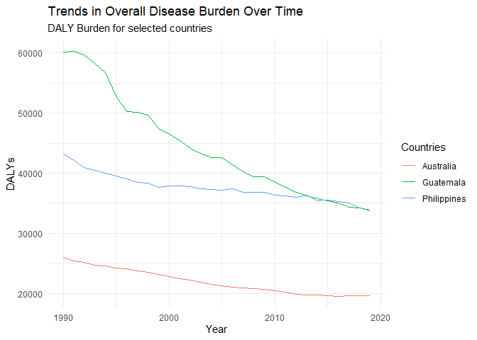

Global Disease Burden Analysis
================
ROSA LEA BALDEVARONA, ROCIO ESCOBAR, EVELYNE FOURNIER

# Introduction

This document compares the Disability-Adjusted Life Year (DALY) diseases
burden for three countries: Australia, Guatemala and the Philippines. We
compare the burden due to communicable, maternal, neonatal, and
nutritional diseases (CMNN), non-communicable diseases (NCDs), and
overall disease burden for these countries.

The source data is from the Institute for Health Metrics and Evaluation
(IHME) Global Burden of Disease (GBD) study.

# Communicable, Maternal, Neonatal, and Nutritional Disease Burden (CMNN)

## Table of Estimates for CMNN Burden Over Time

<table class="table" style="color: black; width: auto !important; margin-left: auto; margin-right: auto;">
<caption>
Table 1: DALY burden over time for Australia, Guatemala and Philipines
</caption>
<thead>
<tr>
<th style="text-align:right;font-weight: bold;">
Year
</th>
<th style="text-align:right;font-weight: bold;">
Australia
</th>
<th style="text-align:right;font-weight: bold;">
Guatemala
</th>
<th style="text-align:right;font-weight: bold;">
Philippines
</th>
</tr>
</thead>
<tbody>
<tr>
<td style="text-align:right;">
1990
</td>
<td style="text-align:right;">
1539.5719
</td>
<td style="text-align:right;">
26959.245
</td>
<td style="text-align:right;">
15958.382
</td>
</tr>
<tr>
<td style="text-align:right;">
1991
</td>
<td style="text-align:right;">
1489.3025
</td>
<td style="text-align:right;">
26289.684
</td>
<td style="text-align:right;">
15195.089
</td>
</tr>
<tr>
<td style="text-align:right;">
1992
</td>
<td style="text-align:right;">
1491.0111
</td>
<td style="text-align:right;">
25336.866
</td>
<td style="text-align:right;">
14783.262
</td>
</tr>
<tr>
<td style="text-align:right;">
1993
</td>
<td style="text-align:right;">
1451.7731
</td>
<td style="text-align:right;">
23977.143
</td>
<td style="text-align:right;">
14380.337
</td>
</tr>
<tr>
<td style="text-align:right;">
1994
</td>
<td style="text-align:right;">
1432.4273
</td>
<td style="text-align:right;">
22635.598
</td>
<td style="text-align:right;">
13876.810
</td>
</tr>
<tr>
<td style="text-align:right;">
1995
</td>
<td style="text-align:right;">
1401.5140
</td>
<td style="text-align:right;">
20531.201
</td>
<td style="text-align:right;">
13408.199
</td>
</tr>
<tr>
<td style="text-align:right;">
1996
</td>
<td style="text-align:right;">
1391.3776
</td>
<td style="text-align:right;">
19140.980
</td>
<td style="text-align:right;">
12988.338
</td>
</tr>
<tr>
<td style="text-align:right;">
1997
</td>
<td style="text-align:right;">
1325.2624
</td>
<td style="text-align:right;">
18640.092
</td>
<td style="text-align:right;">
12522.044
</td>
</tr>
<tr>
<td style="text-align:right;">
1998
</td>
<td style="text-align:right;">
1287.1726
</td>
<td style="text-align:right;">
18004.688
</td>
<td style="text-align:right;">
12199.464
</td>
</tr>
<tr>
<td style="text-align:right;">
1999
</td>
<td style="text-align:right;">
1296.9610
</td>
<td style="text-align:right;">
16920.314
</td>
<td style="text-align:right;">
11588.719
</td>
</tr>
<tr>
<td style="text-align:right;">
2000
</td>
<td style="text-align:right;">
1274.5711
</td>
<td style="text-align:right;">
16124.014
</td>
<td style="text-align:right;">
11324.390
</td>
</tr>
<tr>
<td style="text-align:right;">
2001
</td>
<td style="text-align:right;">
1254.4053
</td>
<td style="text-align:right;">
15700.123
</td>
<td style="text-align:right;">
11127.493
</td>
</tr>
<tr>
<td style="text-align:right;">
2002
</td>
<td style="text-align:right;">
1237.0131
</td>
<td style="text-align:right;">
14832.465
</td>
<td style="text-align:right;">
10912.936
</td>
</tr>
<tr>
<td style="text-align:right;">
2003
</td>
<td style="text-align:right;">
1222.7202
</td>
<td style="text-align:right;">
13925.485
</td>
<td style="text-align:right;">
10666.509
</td>
</tr>
<tr>
<td style="text-align:right;">
2004
</td>
<td style="text-align:right;">
1204.7838
</td>
<td style="text-align:right;">
13119.176
</td>
<td style="text-align:right;">
10553.556
</td>
</tr>
<tr>
<td style="text-align:right;">
2005
</td>
<td style="text-align:right;">
1182.8490
</td>
<td style="text-align:right;">
12577.354
</td>
<td style="text-align:right;">
10328.272
</td>
</tr>
<tr>
<td style="text-align:right;">
2006
</td>
<td style="text-align:right;">
1155.4986
</td>
<td style="text-align:right;">
11785.987
</td>
<td style="text-align:right;">
10299.519
</td>
</tr>
<tr>
<td style="text-align:right;">
2007
</td>
<td style="text-align:right;">
1116.1467
</td>
<td style="text-align:right;">
11137.910
</td>
<td style="text-align:right;">
10105.199
</td>
</tr>
<tr>
<td style="text-align:right;">
2008
</td>
<td style="text-align:right;">
1090.4828
</td>
<td style="text-align:right;">
10507.006
</td>
<td style="text-align:right;">
9907.263
</td>
</tr>
<tr>
<td style="text-align:right;">
2009
</td>
<td style="text-align:right;">
1086.8634
</td>
<td style="text-align:right;">
9965.466
</td>
<td style="text-align:right;">
9823.857
</td>
</tr>
<tr>
<td style="text-align:right;">
2010
</td>
<td style="text-align:right;">
1071.4107
</td>
<td style="text-align:right;">
9350.254
</td>
<td style="text-align:right;">
9694.186
</td>
</tr>
<tr>
<td style="text-align:right;">
2011
</td>
<td style="text-align:right;">
1044.3467
</td>
<td style="text-align:right;">
8823.497
</td>
<td style="text-align:right;">
9482.070
</td>
</tr>
<tr>
<td style="text-align:right;">
2012
</td>
<td style="text-align:right;">
1010.1303
</td>
<td style="text-align:right;">
8421.851
</td>
<td style="text-align:right;">
9152.378
</td>
</tr>
<tr>
<td style="text-align:right;">
2013
</td>
<td style="text-align:right;">
1008.8651
</td>
<td style="text-align:right;">
8103.441
</td>
<td style="text-align:right;">
8921.654
</td>
</tr>
<tr>
<td style="text-align:right;">
2014
</td>
<td style="text-align:right;">
991.5073
</td>
<td style="text-align:right;">
7775.994
</td>
<td style="text-align:right;">
8784.079
</td>
</tr>
<tr>
<td style="text-align:right;">
2015
</td>
<td style="text-align:right;">
988.7599
</td>
<td style="text-align:right;">
7449.704
</td>
<td style="text-align:right;">
8767.712
</td>
</tr>
<tr>
<td style="text-align:right;">
2016
</td>
<td style="text-align:right;">
974.0872
</td>
<td style="text-align:right;">
7241.684
</td>
<td style="text-align:right;">
8561.664
</td>
</tr>
<tr>
<td style="text-align:right;">
2017
</td>
<td style="text-align:right;">
961.4285
</td>
<td style="text-align:right;">
6942.942
</td>
<td style="text-align:right;">
8450.030
</td>
</tr>
<tr>
<td style="text-align:right;">
2018
</td>
<td style="text-align:right;">
950.7359
</td>
<td style="text-align:right;">
6796.594
</td>
<td style="text-align:right;">
8080.506
</td>
</tr>
<tr>
<td style="text-align:right;">
2019
</td>
<td style="text-align:right;">
938.9248
</td>
<td style="text-align:right;">
6649.446
</td>
<td style="text-align:right;">
7841.392
</td>
</tr>
</tbody>
</table>

## Plot Showing Trends in CMNN Burden Over Time

<!-- -->

## Summary of CMNN Burden Findings

Regardless of the time period, Guatemala and the Philippines
consistently experience a higher burden of communicable, maternal,
neonatal, and nutritional diseases (CMNN) compared to Australia. From
1990 to 2019, the Disability-Adjusted Life Years (DALYs) from CMNN
steadily declined in all three countries. However, the decrease in DALY
burdens was significantly more pronounced in Guatemala and the
Philippines than in Australia. Specifically, Guatemala’s DALY burden for
CMNN decreased from approximately 27,000 in 1990 to 6,700 in 2019.
Meanwhile, in the Philippines, the DALY burden reduced from 16,000 to
7,800 over the same period.

# Non-Communicable Disease Burden (NCD)

## Table of Estimates for NCD Burden Over Time

| Year | Australia | Guatemala | Philippines |
|-----:|----------:|----------:|------------:|
| 1990 |  20910.31 |  24734.41 |    22350.97 |
| 1991 |  20483.92 |  25478.18 |    21920.05 |
| 1992 |  20294.06 |  25896.08 |    21940.06 |
| 1993 |  19978.86 |  26254.00 |    21981.92 |
| 1994 |  19876.85 |  26004.09 |    22029.13 |
| 1995 |  19624.51 |  24465.72 |    22047.08 |
| 1996 |  19461.13 |  23685.71 |    22232.67 |
| 1997 |  19233.22 |  23862.38 |    22223.44 |
| 1998 |  18992.07 |  24018.39 |    22374.94 |
| 1999 |  18740.97 |  23523.11 |    22489.80 |
| 2000 |  18467.31 |  23404.79 |    22813.14 |
| 2001 |  18181.01 |  23191.95 |    23142.42 |
| 2002 |  17997.19 |  22829.82 |    23430.59 |
| 2003 |  17746.36 |  22775.12 |    23360.65 |
| 2004 |  17522.61 |  22827.56 |    23347.25 |
| 2005 |  17302.04 |  22718.08 |    23666.45 |
| 2006 |  17112.47 |  22678.75 |    23721.66 |
| 2007 |  17053.32 |  22380.40 |    23607.68 |
| 2008 |  16955.95 |  22172.54 |    23776.59 |
| 2009 |  16788.48 |  22346.87 |    23818.85 |
| 2010 |  16625.33 |  22592.96 |    23719.61 |
| 2011 |  16480.76 |  22681.21 |    23697.51 |
| 2012 |  16255.88 |  22571.69 |    23778.89 |
| 2013 |  16133.95 |  22476.69 |    23769.65 |
| 2014 |  16086.16 |  22430.60 |    23751.02 |
| 2015 |  16053.35 |  22430.35 |    23840.80 |
| 2016 |  15950.46 |  22365.16 |    23738.39 |
| 2017 |  15976.50 |  22069.25 |    23552.32 |
| 2018 |  16048.14 |  21878.40 |    23331.00 |
| 2019 |  16056.02 |  21808.70 |    23163.47 |

## Plot Showing Trends in NCD Burden Over Time

<!-- -->

## Summary of NCD Burden Findings

In the 30-year period, Australia shows a promising trend of drastic
decrease from its values in 1990 to 2016. Guatemala shows a slow
decreasing trend in the DALY burden from 1998 to 2019. In contrast to
the downward trends of DALY burden for Guatemala and Australia, there is
an increasing pattern for the Philippines beginning in the year 1991.

# Overall Disease Burden

## Table of Estimates for Overall Disease Burden Over Time

| Year | Australia | Guatemala | Philippines |
|-----:|----------:|----------:|------------:|
| 1990 |  26008.86 |  60188.16 |    43149.40 |
| 1991 |  25401.58 |  60306.98 |    42137.21 |
| 1992 |  25125.72 |  59688.69 |    40959.93 |
| 1993 |  24686.07 |  58302.59 |    40536.11 |
| 1994 |  24564.33 |  56764.24 |    39960.87 |
| 1995 |  24253.82 |  52824.72 |    39483.62 |
| 1996 |  24087.24 |  50266.53 |    39060.23 |
| 1997 |  23770.25 |  50085.11 |    38489.42 |
| 1998 |  23467.79 |  49646.69 |    38302.82 |
| 1999 |  23180.86 |  47413.75 |    37705.04 |
| 2000 |  22814.91 |  46451.73 |    37885.01 |
| 2001 |  22418.30 |  45409.12 |    37879.61 |
| 2002 |  22164.60 |  44122.01 |    37824.40 |
| 2003 |  21854.57 |  43272.61 |    37432.44 |
| 2004 |  21544.97 |  42612.36 |    37271.14 |
| 2005 |  21262.74 |  42575.46 |    37214.25 |
| 2006 |  21024.34 |  41469.73 |    37385.60 |
| 2007 |  20923.68 |  40219.62 |    36810.60 |
| 2008 |  20797.99 |  39456.51 |    36869.26 |
| 2009 |  20643.87 |  39361.79 |    36839.50 |
| 2010 |  20403.87 |  38520.65 |    36390.98 |
| 2011 |  20201.39 |  37646.35 |    36226.05 |
| 2012 |  19895.18 |  36794.56 |    35986.03 |
| 2013 |  19744.50 |  36238.73 |    36300.91 |
| 2014 |  19684.70 |  35724.93 |    35418.66 |
| 2015 |  19666.82 |  35356.87 |    35510.18 |
| 2016 |  19542.28 |  35004.55 |    35265.92 |
| 2017 |  19564.38 |  34362.62 |    35017.88 |
| 2018 |  19622.73 |  34178.88 |    34278.84 |
| 2019 |  19607.61 |  33837.48 |    33798.13 |

## Plot Showing Trends in Overall Disease Burden Over Time

<!-- -->

## Summary of Overall Disease Burden Findings

We notice an important difference of DALYs between the 3 countries.
Guatemala shows much higher DALY burden than Australia and Philippines
in 1990, however it is drastically reduced by 2020 reporting similar
numbers than Philippines. The three countries show a promising trend
over the 30 year period with a decreasing DALY over time.
